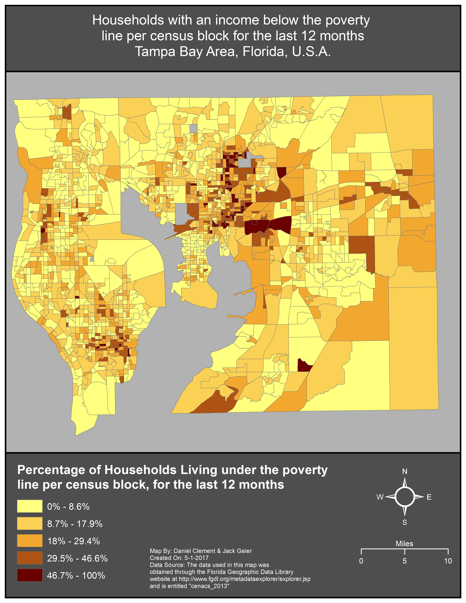

# Demographic Analysis of Higher Education Institutions in Florida and
#### By: Daniel Clement & jack Geier
---
## Abstract

&nbsp;&nbsp;&nbsp;&nbsp;&nbsp;This project will use data from the Integrated Postsecondary Education Data System (IPEDS), and cross reference it with a G.I.S. Data layer which contains US Census Bureau 2010 Census Block Groups for the State of Florida with selected fields from the 2009-2013 American Community Survey (ACS). With these data sets we intend to perform analysis to determine if there are any trends or correlations we can identify. Some possible questions we could look at are and graduation rates as well as tuition costs compared to various demographics.

## Data Transparency and Manipulations

#### **Web Scraping attempt**

&nbsp;&nbsp;&nbsp;&nbsp;&nbsp;For our project, we found the World Higher Education Database (WHED) website. This website is run by the International Association of Universities (IAU), is a database of over 18,000 higher education institutions from 182 countries. This Site provides this data in purely viewable, searchable format, free of charge in a searchable format. However, members of the IAU can access additional features, advanced search options, as well as the ability to download and print the data. 
- *Below is a screenshot of the WHED’s main website.*

&nbsp;&nbsp;&nbsp;&nbsp;&nbsp;Web scraping is a process of obtaining data from the internet, and saving it in a local copy, usually a spreadsheet, on your personal computer.  To do this web scraping, in the past, required an advanced working knowledge of a programing language, such as Python. Recently, this process has been made accessible to the masses through a free Google Chrome extension entitled “Web Scraper”, which was created by Martins Balodis. I concluded that using Web Scraper, I would attempt to obtain a small subset of the dataset, which would comprise only the institutions located in Florida, USA.  

&nbsp;&nbsp;&nbsp;&nbsp;&nbsp;I initially thought I could use the same structure as Prof. Thomas had with the previous selector. And this is what I came up with ( div.details:nth-of-type(1) h3 p p a ). This did not work. I did however figure out that if I inspect the element I wanted and then right clicked the html code it allowed me to "copy selector" and it copies the following to the clipboard: " #results > li:nth-child(1) > div.details > p.tools.fright > a ". This works when you enter it into the selector box in the web-scraper. However, the issue is that I cannot get the rest of the links to light up. I have the multiple links box checked, but when I click the second "plus" sign it does not auto select the rest of the links as usual.    

&nbsp;&nbsp;&nbsp;&nbsp;&nbsp;I could discern that each of the links I was attempting to select, had a URL that identical, aside from a few id numbers. For instance, the first links URL is " http://www.whed.net/detail_institution.php?id=26 " and the second one is " http://www.whed.net/detail_institution.php?id=30 ". I noticed also that the url's unique id's are not sequential and instead being fairly random. Remembering that Professor Thomas had previously shown the class how he used this exact feature to scrape another site. However, for this tactic to be successful, the URL’s had to be sequential.  

&nbsp;&nbsp;&nbsp;&nbsp;&nbsp;After much more trial and error, I noticed that the working selector was, #results > li:nth-child(1) > div.details > p.tools.fright > a, and that the number in the parenthesis is the number of link it is. For instance, if you change it to 2 it selects the 2nd link, and so on. This theoretically was another avenue for scraping this site. 
- *Below is a screenshot the farthest we could get in the webscrapping process.*

&nbsp;&nbsp;&nbsp;&nbsp;&nbsp;It was at this point that I deferred to Professor Thomas who was also unable to crack the metaphorical code, and get the scrapper to work for this website. It was discovered that this website used PHP, which is an acronym for Hypetext Preprocessor, and is a widely-used open source scripting language made for web development and finally which is able to be embedded into HTML code. This makes the site virtually impossible to scrape with the Web Scraper Chrome extension. 

#### **New site**
&nbsp;&nbsp;&nbsp;&nbsp;&nbsp;Unable to obtain any usable data from the WHED site, we began searching for an alternative data set. This is when we happened to come across another site run by the U.S. Department of Education. The Integrated Postsecondary Education Data System, or IPEDS, is a database that contains information gathered from annually conducted surveys by the Department of Education. Institutions who receive federal student aid are required to participate in this survey by law, with over 7,500. The IPEDS provides information including institutional characteristics, pricing, admissions, enrollment, student financial aid, degrees and certificates conferred, student persistence and success, as well as institutional resources.  
- *Below is a screenshot of the main IPEDS website.*

&nbsp;&nbsp;&nbsp;&nbsp;&nbsp;The IPEDS website did not require us to scrape it. Conveniently, they allow you to customize a subset of their data, with only the information you care about, and then download it directly to your computer as a spreadsheet. This was incredibly useful as we did not have to spend time attempting to web scrape the data. Some of the fields we got with this data are Average salary equated to 9 months of full-time instructional staff, Admittance percentages, highest degree offered, total price of attendance for one year tuition, graduation rates broken down into various races/ethnicities. This data will be used to compare against another data set which contains various demographic information from the state of Florida. 
- *Below is a screenshot the Data Portal page of the IPEDS website.*

&nbsp;&nbsp;&nbsp;&nbsp;&nbsp;The dataset which we will use to compare the educational institution data to is a dataset which was obtained from the Florida Geographic Data Library website. This website is a data portal run by the State of Florida which contains a myriad of different geographic information systems datasets. The dataset used by us was delivered in the Shapefile format, which is a G.I.S. format, that contains both the underlying data, which is geocoded to, in this case, political boundaries.  The dataset, entitled Cenacs_2013, is comprised of the census block tracts that comprise Florida. Attached to each of these census block tracts are selected fields from the 2013 American Community Survey. Demographic information such as age, sex, race, and economic trends is contained within each block. We will be comparing this information with the IPEDS data using digital humanities techniques and processes, to identify any trends which may appear.
- *Below is a screenshot the page where we were able to customize the dataset we wanted to download.*

## Historiography

## Results

- *Below is a map showing census blocks colored by the percentage of households living under the poverty line for the last 12 months.*

- *Below is a table depicting the highest degrees offered by institutions in Hillsborough County.*

#### As is evident by the graph, there are a wide variety of degrees offered by institions. As a result, this makes it more convenient and accessible for everyone to attain a higher education degree of some form. However, this does not mean that attaining the degree will be any easier, just that there is more of an opportunity presented. 

 
 

- *Below is a table depicting the graduation rates for various institutions in Hillsborough County, catagorized by race.*

#### Within the various schools the graduation rates are fairly similar between the races. However, One outlier is evident at ITT Technical Institute. At this school, students who identify as Asian, have a 100% graduation rate. This could be happening for a few reasons. One, obviously is that the Asian students at this school have great aptitude for technical degrees. The other possibility is that there were a small number of Asian students, and they all happened to graduate. 

 
 

- *Below is a table depicting the graduation rates in Hillsborough County, catagorized by gender.*

#### According to the data, men and women are very close in graduation rates, with men slightly under women by about 2%. Historically, women have been underprivileged in society at large, but particularlly in higher education their acomplishments have been trivialized. This could plausably be signs that things are changing for the better, with more women graduating than men.  

- *Below is a table depicting the average graduation rate by county.*

- *Below is a table depicting the average graduation rate by county.*

Some schools have no data, problem with reporting system.

