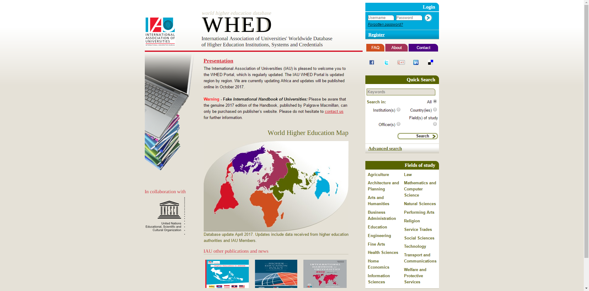
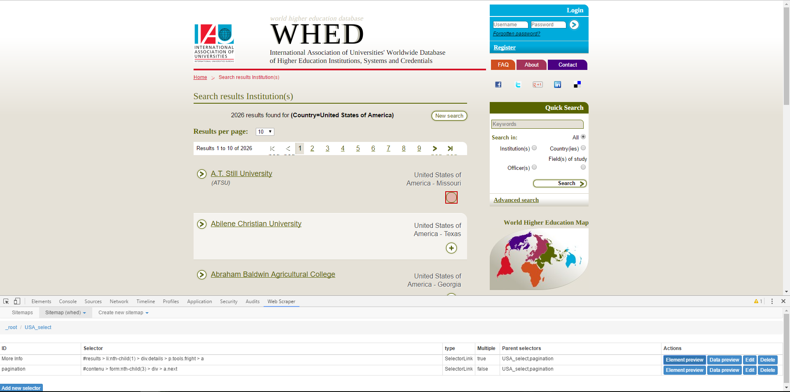
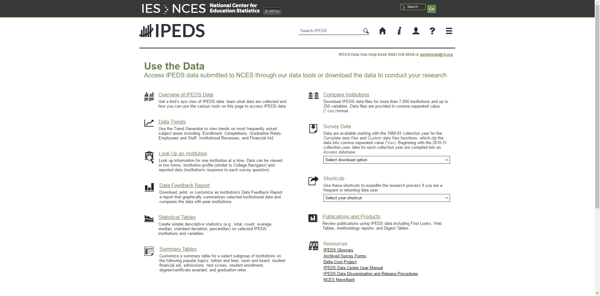
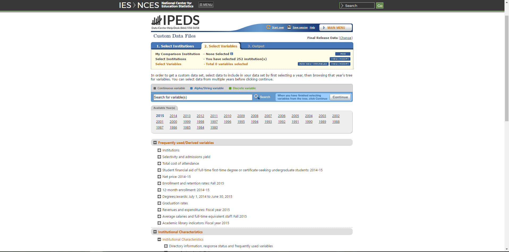
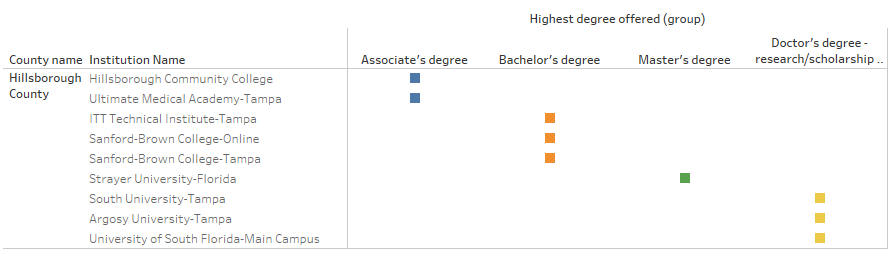
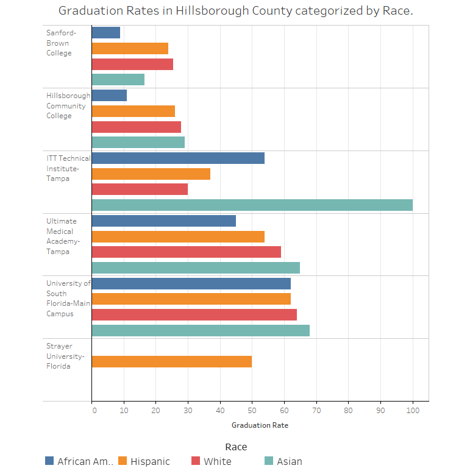
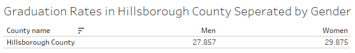
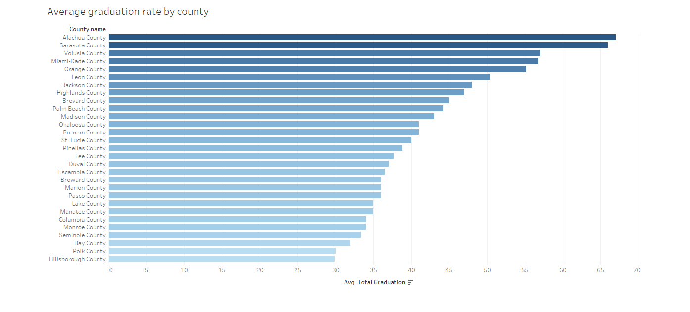
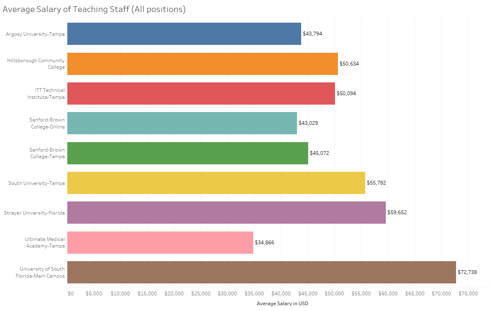

# Demographic Analysis of Higher Education Institutions in Florida
#### By: Daniel Clement & Jack Geier

 

# Abstract

&nbsp;&nbsp;&nbsp;&nbsp;&nbsp;This project will use data from the Integrated Postsecondary Education Data System (IPEDS). With this data set we intend to perform analysis to determine if there are any trends or correlations become evident. Some possible questions we could look at are and graduation rates as well as teacher salaries, compared to various demographics.

# Data Transparency and Manipulations

### **Web Scraping attempt**

&nbsp;&nbsp;&nbsp;&nbsp;&nbsp;For our project, we found the World Higher Education Database (WHED) website. This website is run by the International Association of Universities (IAU), is a database of over 18,000 higher education institutions from 182 countries. This Site provides this data in purely viewable, searchable format, free of charge in a searchable format. However, members of the IAU can access additional features, advanced search options, as well as the ability to download and print the data. 
- *Below is a screenshot of the WHED’s main website.*

&nbsp;&nbsp;&nbsp;&nbsp;&nbsp;Web scraping is a process of obtaining data from the internet, and saving it in a local copy, usually a spreadsheet, on your personal computer.  To do this web scraping, in the past, required an advanced working knowledge of a programing language, such as Python. Recently, this process has been made accessible to the masses through a free Google Chrome extension entitled “Web Scraper”, which was created by Martins Balodis. I concluded that using Web Scraper, I would attempt to obtain a small subset of the dataset, which would comprise only the institutions located in Florida, USA.  

&nbsp;&nbsp;&nbsp;&nbsp;&nbsp;I initially thought I could use the same structure as Prof. Thomas had with the previous selector. And this is what I came up with ( div.details:nth-of-type(1) h3 p p a ). This did not work. I did however figure out that if I inspect the element I wanted and then right clicked the html code it allowed me to "copy selector" and it copies the following to the clipboard: " #results > li:nth-child(1) > div.details > p.tools.fright > a ". This works when you enter it into the selector box in the web-scraper. However, the issue is that I cannot get the rest of the links to light up. I have the multiple links box checked, but when I click the second "plus" sign it does not auto select the rest of the links as usual.    

&nbsp;&nbsp;&nbsp;&nbsp;&nbsp;I could discern that each of the links I was attempting to select, had a URL that identical, aside from a few id numbers. For instance, the first links URL is " http://www.whed.net/detail_institution.php?id=26 " and the second one is " http://www.whed.net/detail_institution.php?id=30 ". I noticed also that the url's unique id's are not sequential and instead being fairly random. Remembering that Professor Thomas had previously shown the class how he used this exact feature to scrape another site. However, for this tactic to be successful, the URL’s had to be sequential.  

&nbsp;&nbsp;&nbsp;&nbsp;&nbsp;After much more trial and error, I noticed that the working selector was, #results > li:nth-child(1) > div.details > p.tools.fright > a, and that the number in the parenthesis is the number of link it is. For instance, if you change it to 2 it selects the 2nd link, and so on. This theoretically was another avenue for scraping this site. 
- *Below is a screenshot the farthest we could get in the webscrapping process.*

&nbsp;&nbsp;&nbsp;&nbsp;&nbsp;It was at this point that I deferred to Professor Thomas who was also unable to crack the metaphorical code, and get the scrapper to work for this website. It was discovered that this website used PHP, which is an acronym for Hypertext Preprocessor, and is a widely-used open source scripting language made for web development and finally which can be embedded into HTML code. This makes the site virtually impossible to scrape with the Web Scraper Chrome extension. 

### **New site**
&nbsp;&nbsp;&nbsp;&nbsp;&nbsp;Unable to obtain any usable data from the WHED site, we began searching for an alternative data set. This is when we happened to come across another site run by the U.S. Department of Education. The Integrated Postsecondary Education Data System, or IPEDS, is a database that contains information gathered from annually conducted surveys by the Department of Education. Institutions who receive federal student aid are required to participate in this survey by law, with over 7,500 institutions participating yearly. The IPEDS provides information including institutional characteristics, pricing, admissions, enrollment, student financial aid, degrees and certificates conferred, student persistence and success, as well as institutional resources.  
- *Below is a screenshot of the main IPEDS website.*

&nbsp;&nbsp;&nbsp;&nbsp;&nbsp;The IPEDS website did not require us to scrape it. Conveniently, they allow you to customize a subset of their data, with only the information you care about, and then download it directly to your computer as a spreadsheet. This was incredibly useful as we did not have to spend time attempting to web scrape the data. Some of the fields we got with this data are Average salary equated to 9 months of full-time instructional staff, Admittance percentages, highest degree offered, total price of attendance for one year tuition, graduation rates broken down into various races/ethnicities. This data will be used to compare against another data set which contains various demographic information from the state of Florida. 
- *Below is a screenshot the Data Portal page of the IPEDS website.*

- *Below is a screenshot the page where we were able to customize the dataset we wanted to download.*

 

# Historical Scholarship

&nbsp;&nbsp;&nbsp;&nbsp;&nbsp;Throughout the ages, access to knowledge has created an influx of prosperity, power and cultural advancement. In a time known as the middle ages, Europe lost the academic works of the classical period after the fall of Rome and was behind compared to other nations of the world such as the Islamic world, who excelled in mathematics, sciences and medicine. In the modern day, the access of knowledge plays a huge role and it’s effects can be just as easily observable as the comparison between Europe and the Middle East during the Middle ages.

&nbsp;&nbsp;&nbsp;&nbsp;&nbsp;In our project we decided to look at the differences in demographics of Florida and compare it with information obtained from IPEDS (Integrated Postsecondary Education Data System). IPEDS is a very good data system that contains data ranging from graduation patterns to financial costs and scholarship information. 

&nbsp;&nbsp;&nbsp;&nbsp;&nbsp;Florida school system was desegregated in 1970. Schools however, were still not on equal levels. The article,*The crossroads of U.S. demographics and higher education: a tale of disparate futures* (Longtine & Jones, 2011), makes the claim that Hispanics, Blacks, and Native Americans are experiencing the “worst of times”. The article goes into explaining that it is possible to analyze the faculty of universities and determine the academic success of the ethnicity. This analysis is accurate however, it only deals with the faculty and not dealing with things such as graduation and attendance rates. When looking back in History at post-secondary trends, it is interesting to look at how the increase in teaching faculty can correlate to the highest degree offered. In New York state during in 1953, nearly one third of students who entered postsecondary education obtained a degree less than a four-year degree (The Journal of Educational Sociology). During the 1960’s and 1970’s it was New York’s goal to increase the number of teaching faculty and it reached 22,000 in 1970. This initiative set the ground stone of providing the option for even higher education (The Journal of Educational Sociology).

&nbsp;&nbsp;&nbsp;&nbsp;&nbsp;Previous historical analysis on Post-secondary system has been hard to find and I have not found anything dealing with Hillsborough county specifically. Our contribution will hopefully allow someone else to make a more informed decision from our work.  

 

# Results

- *Below is a table depicting the highest degrees offered by institutions in Hillsborough County.*

#### As is evident by the graph, there are a wide variety of degrees offered by institions. As a result, this makes it more convenient and accessible for everyone to attain a higher education degree of some form. However, this does not mean that attaining the degree will be any easier, just that there is more of an opportunity presented. 

 

- *Below is a table depicting the graduation rates for various institutions in Hillsborough County, catagorized by race.*

#### Within the various schools the graduation rates are fairly similar between the races. However, One outlier is evident at ITT Technical Institute. At this school, students who identify as Asian, have a 100% graduation rate. This could be happening for a few reasons. One, obviously is that the Asian students at this particular school, all have a great aptitude for technical degrees. Another possibility is that there were a small number of Asian students, and they all coincidentally happened to graduate. Finally, suspect that this number is being skewed in some fashion.

 

- *Below is a table depicting the graduation rates in Hillsborough County, catagorized by gender.*

#### According to the data, men and women are very close in graduation rates, with men slightly under women by about 2%. Historically, women have been underprivileged in society at large, but particularlly in higher education their acomplishments have been trivialized. This could plausably be signs that things are changing for the better, with more women graduating than men.  

 

- *Below is a table depicting the average graduation rate by county.*

#### This information can be helpful when deciding on which College or University to attend. A look at the graph tells us the Alachua county and Sarasota county have the highest graduation rates. A simple google search can then tell you which Colleges and Universities can be found in these counties.  

 

- *Below is a graph depicting the average salaries of teaching staff by institutions within Hillsborough County .*

#### This graph shows that The University of South Florida has the highest average salary. This can plausably be correlated to the fact that USF offers the highest degree level possible. Similarly, Ultimate Medical Academy, which only offers an Associates Degree, has the lowest average salary. 

 

# Conclusion
&nbsp;&nbsp;&nbsp;&nbsp;&nbsp;The IPEDS website states that any institution that participate in or are applicants for participation in any federal student financial aid program, is required to participate in their survey. One observation which can be made about the data set we obtained from the IPEDS site is that many institutions report basic information, however their participation fully in the survey is not happening. Incomplete data in many of the variables we analyzed lead to an incomplete picture and left holes in the research. In theory, the incomplete nature of many institutions data, could change the outcomes and interpretations of any analysis based on the data set. Compliance with the mandate to participate in this survey may need to be enforced better, as this important resource for educators, potential students, and researchers in general. 

&nbsp;&nbsp;&nbsp;&nbsp;&nbsp;The need for complete and reliable data sets are extremely important. Big data sets like this usually contain interesting attributes, but can also be left un complete in some areas. This often creates skewed graphics that appeal to people who tend to only look at the picture and not the data behind it. Transparency is the key. This project has brought to light the concept that statistics and graphs can be skewed, while also being accurate at the same time. 

 

### A bit on the Digital Humanities Research process
&nbsp;&nbsp;&nbsp;&nbsp;&nbsp;Web scraping certainly has a huge upside when applied correctly. However, there is still wisdom and merit in one taking the time to do a more extensive internet search for your data sources. Use web scraping as one of the tools in your metaphorical toolbox, and do not go to it right away. With a simple few minutes spent doing a search for potential data sources, you can save much hassle from attempting a scrape. However, there is also much to be said for web scraping's potential to make accessible data sets which were once out of reach. Often, it is simply unrealistic to attempt collecting the data through tedious copy and pasting, and this is where web scraping will shine, proving its worth as one more tool in the digital humanist's toolbox.

 
 

### Acknowledgement
&nbsp;&nbsp;&nbsp;&nbsp;&nbsp;Professor Dave Thomas, who challenged us, and taught us that failing is often the first step to succeeding. As well, that in sharing our failures in scholarship, we can often learn valuable lessons so that others do not have to waste precious time investigating dead ends. Professor Thomas also provided us with invaluable advice and guidance during our struggles with web scrapping. 

 

# Works Cited

1. WHED. (n.d.). Retrieved April 30, 2017, from [http://www.whed.net/home.php](https://nces.ed.gov/ipeds/)
2. IPEDS. (n.d.). Retrieved April 30, 2017, from [https://nces.ed.gov/ipeds/](https://nces.ed.gov/ipeds/)
3. FGDL. (n.d.). Retrieved April 30, 2017, from [http://www.fgdl.org/metadataexplorer/explorer.jsp](http://www.fgdl.org/metadataexplorer/explorer.jsp) 
4. Longtine, C., & Jones, M. (2011). The crossroads of U.S. demographics and higher education: a tale of disparate futures. Council On Undergraduate Research Quarterly, (3), 29.

 

# Applications used:

1. Tableau -                   [https://www.tableau.com/](https://www.tableau.com/) 
2. Web Scraper -               [https://github.com/martinsbalodis/web-scraper-chrome-extension](https://github.com/martinsbalodis/web-scraper-chrome-extension)
3. GitHub -                    [https://github.com/](https://github.com/)

### Project By:
#### Jack Geier & Daniel Clement

